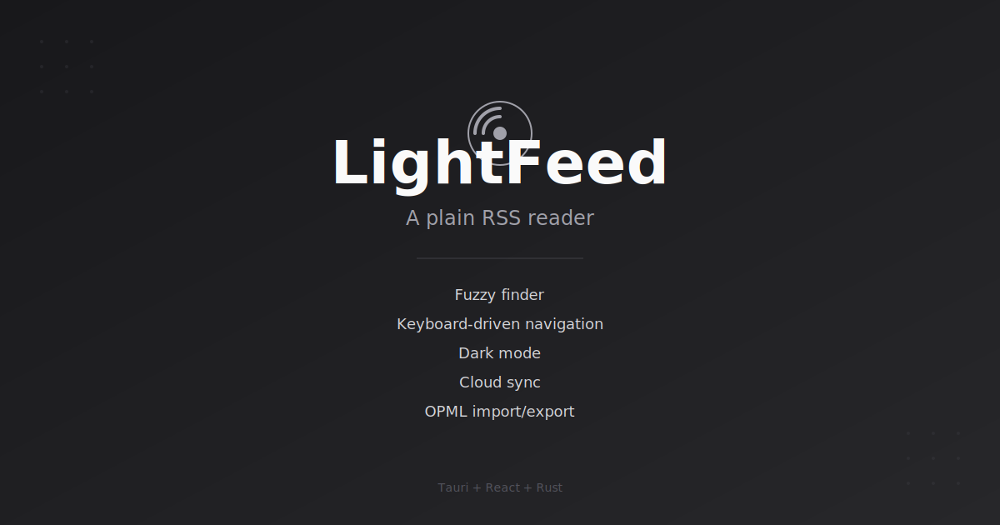
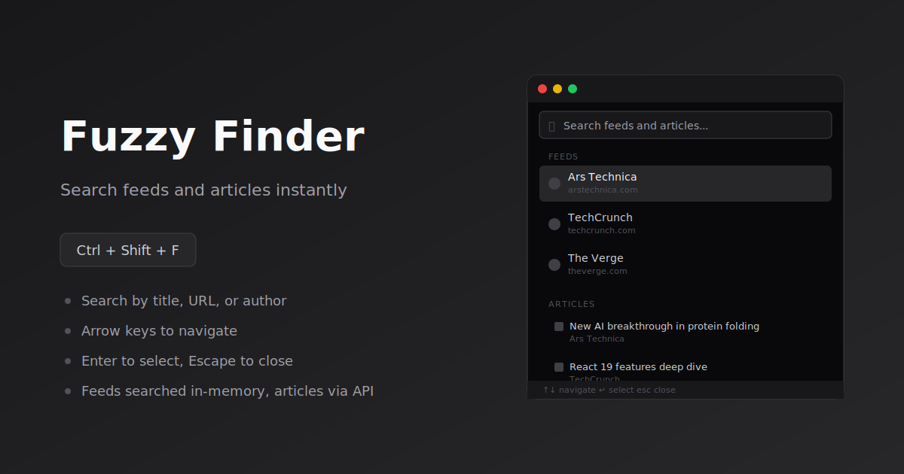
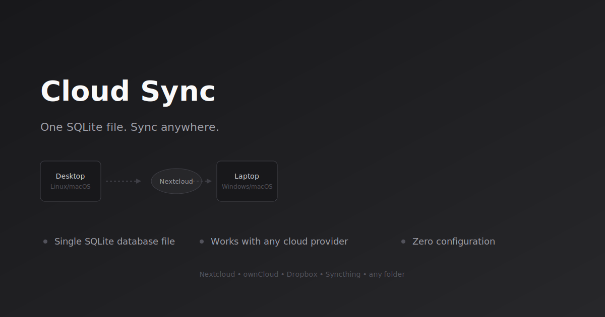
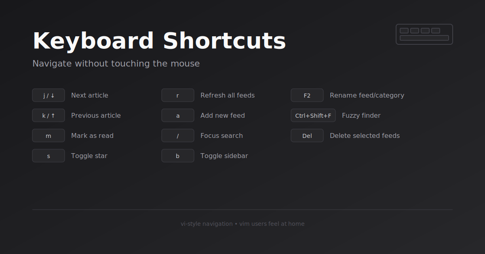

# LightFeed

A plain RSS reader built with Tauri.



## Features

- RSS/Atom feed subscription and management
- Categories and drag-and-drop organization
- Readable article extraction (reader mode)
- OPML import/export
- Keyboard shortcuts
- Fuzzy finder (Ctrl+Shift+F)
- Dark mode
- Customizable storage location
- Automated cleanup of old entries
- Cloud sync — point storage at your synced folder (ownCloud, Nextcloud, etc.)

## Fuzzy Finder

Press `Ctrl+Shift+F` to open the fuzzy finder. Search through all your feeds and articles by title, URL, or author.

- **Feeds** are matched in-memory (instant)
- **Articles** are searched via the backend after a short debounce
- Arrow keys to navigate, Enter to select, Escape to close
- Selecting a feed opens it; selecting an article loads it in the reader



## Cloud Sync

LightFeed stores everything in a single SQLite database file. To sync across devices:

1. Set up a folder shared by your cloud provider (ownCloud, Nextcloud, Dropbox, Syncthing, etc.)
2. Open Settings → Storage → Move to... and select that folder
3. Repeat on each device, choosing **Use Existing** when prompted

All feeds, subscriptions, read states, and stars stay in sync automatically.



## OPML

OPML (Outline Processor Markup Language) is an XML format for storing lists of feed subscriptions. LightFeed can import and export OPML files to transfer subscriptions between RSS readers.

Example file (`resources/example.opml`):

```xml
<?xml version="1.0" encoding="UTF-8"?>
<opml version="2.0">
  <head>
    <title>News Subscriptions</title>
  </head>
  <body>
    <outline title="News" text="News">
      <outline type="rss" text="BBC News" xmlUrl="https://bbci.co.uk" />
      <outline type="rss" text="Reuters: Top News" xmlUrl="https://reuters.com" />
    </outline>
    <outline title="Technology" text="Technology">
      <outline type="rss" text="Ars Technica" xmlUrl="http://feeds.arstechnica.com/arstechnica/index" />
      <outline type="rss" text="TechCrunch" xmlUrl="https://techcrunch.com" />
    </outline>
  </body>
</opml>
```

Feeds can be organized into categories using `<outline>` groups. Import via Settings → Import/Export.

## Keyboard Shortcuts



LightFeed uses vi-style navigation. See the sidebar for all available shortcuts.

## Tech Stack

- **Frontend:** React, TypeScript, Tailwind CSS, Zustand
- **Backend:** Tauri (Rust), rusqlite
- **Build:** Vite, Tauri CLI

## Development

```bash
npm install
npm run dev
```

## Build & Package

```bash
npm run build
```

Or use the Makefile:

```bash
make build
make clean
```

## Author

mandrewcito

## Homepage

https://lightfeed.mandrewcito.dev
